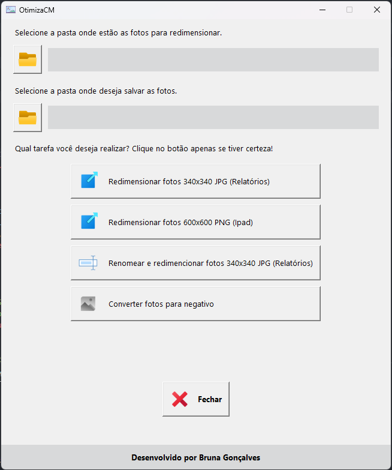

# OtimizaCM

Sistema iniciante, no momento estou estudando Python, e essa foi a melhor opção que encontrei para poder praticar.

**This code has a lot to be improved!**

<div align="center">



</div>

## Command to generate the executable

```
pyinstaller --noconsole --windowed --name OtimizaCM --icon=ico.ico otimiza.py
```

## 🧪 Technologies

- [Python](https://www.python.org/)
- [Tkinter](https://docs.python.org/3/library/tkinter.html)
- [PIL](https://pypi.org/project/Pillow/)
- [Pyinstaller](https://pyinstaller.org/en/stable/)

---

<p align="center">Made with 💜 by Bruna Goncalves</p
